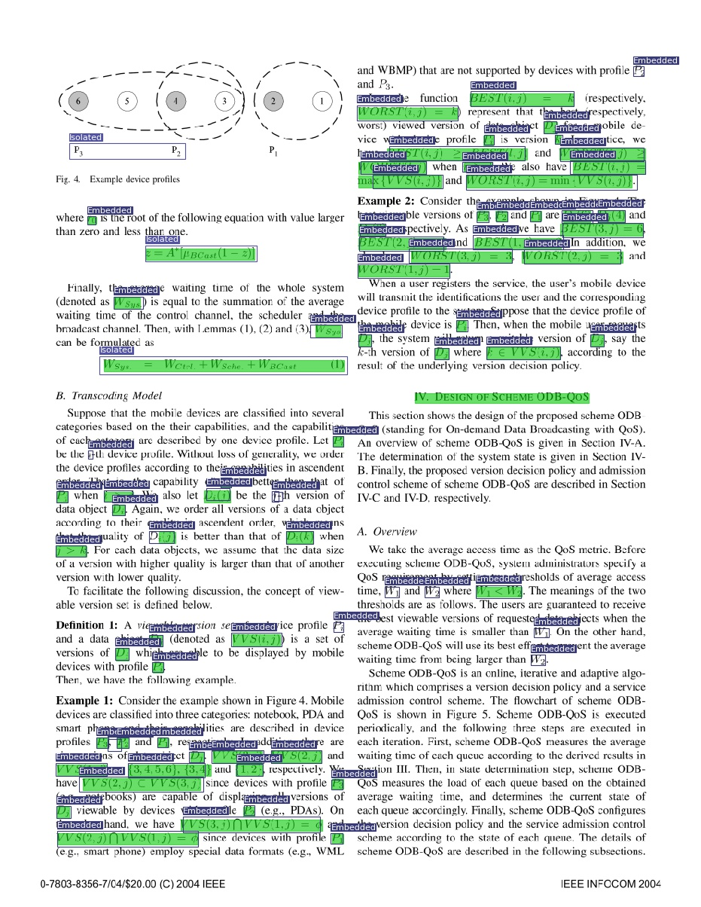
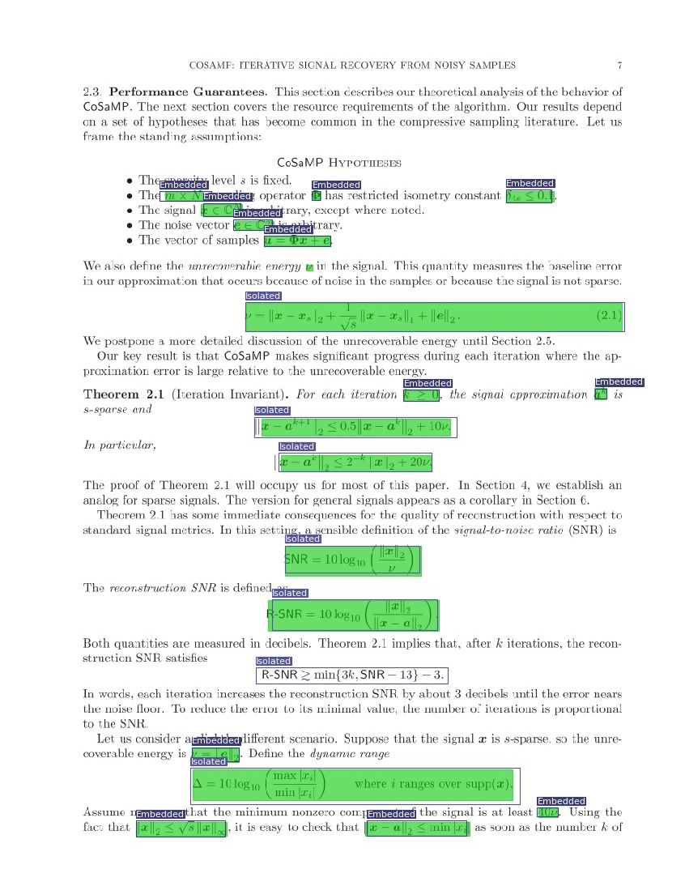

# YOLO4MATH

Detecting mathematical expressions in scientific papers using YOLO and SSD

## YOLO

YOLOv3 to detect mathematical expressions in scientific papers

The number of filters previous to the YOLO layers must be computed with the following formula:

```
num_clusters * (num_classes + 5)
```

where `num_clusters` are the number of clusters used by the YOLO layer, not the total number.

## Examples

### YOLOv3





## SSD

The same... but with SSD 🤷🏻‍♂️
